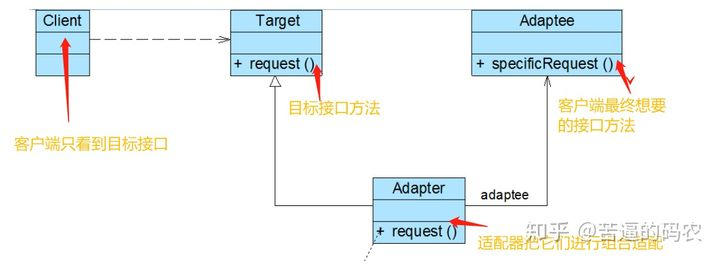

### 适配器模式

适配器模式（Adapter Pattern）是作为两个不兼容的接口之间的桥梁，它结合了两个独立接口的功能。

这种模式涉及到一个单一的类，该类负责加入独立的或不兼容的接口功能。

适配器模式把一个类的接口变换成客户端所期待的另一种接口，从而使原本因接口不匹配而无法在一起工作的两个类能够在一起工作。


**类型：结构类模式**

举个例子：我们想用苹果的充电线给安卓的手机充电时。由于两者的接口不一样，会导致充电口无法匹配。这时，我们就需要适配器，将安卓的充电接口转化为苹果的接口，这样，就可以进行充电了。

在适配器模式中，存在两种不同的模式结构：**类的适配器模式和对象的适配器模式**

#### 对象的适配器模式

我们以上面的苹果充电线给安卓手机充电的为例，如果是你来写代码，把他们进行兼容适配，该如何处理？

对于这个问题，我们首先先来看一下适配器模式中涉及到的三个角色：

- Target（目标抽象类）：目标抽象类定义客户所需接口，可以是一个抽象类或接口，也可以是具体类。例如对于上面的例子，客户端的目标是要给只接受安卓充电口的安卓手机充电，所以我们的目标抽象类就是安卓充电线的接口。

- Adaptee（适配者类）：适配者即被适配的角色，它定义了一个已经存在的接口，这个接口需要适配，适配者类一般是一个具体类，包含了客户希望使用的业务方法。例如上面苹果充电线就是适配者类。

- Adapter（适配器类）：通过包装一个需要适配的对象，把原接口转换成目标接口。例如为了可以充电，我们需要一个适配器，使之一边可以连接安卓充电的接口，一边可以连接苹果充电线的接口。

UML图：



以下我们用代码做个示例：

Target类
```java
public class Android {
    public void isAndroid(){
        System.out.println("这是一个只接受安卓充电线的插口");
    }
}
```
Adaptee类
```java
public class Iphone {
    public void isIphone(){
        System.out.println("这是一个适配苹果充电线的插口");
    }
}
```
Adapter类：把他们进行适配
```java
public class Adapter extends Android{
    private Iphone iphone;

    public Adapter(Iphone iphone){
        this.iphone = iphone;
    }

    @Override
    public void isAndroid() {
        iphone.isIphone();
    }
}
```
测试类
```java
public class Demo {
    public static void main(String[] args){
        Android android = new Adapter(new Iphone());
        //调用的是安卓的接口，但实际上
        //确实一个可以接受苹果充电器的接口
        android.isAndroid();
    }
}
```
打印内容
> 这是一个适配苹果充电线的插口

我们通过适配器的作用，就可以让苹果充电线给安卓手机充电了。。

对于这种对象的适配器模式，实际上就是通过一个适配器类，把目标类和需要被适配的类进行组合。所以适配器类Adapter一般需要继承或实现Targert，并且还得持有Adaptee的实例引用。

#### 类的适配器模式

除了对象的适配器模式，还有另外一种类的适配器模式。在这种模式中，Adapter不持有Adaptee的实例引用，而是直接继承Adaptee类，然后再实现Target接口。或者直接继承Adaptee类和Target类，但由于Java中不支持多重继承，所以只能用实现Target的方式。

这也导致了在Jaca类的适配器模式中，Target必须是一个接口而不可以是抽象类和具体类(因为Java不支持多重继承)。

把上面那个例子改写一下，用类的适配器模式来实现：

Target接口类
```java
interface Android {
    void isAndroid();
}
```
Adaptee类
```java
public class Iphone {
    public void isIphone(){
        System.out.println("这是一个适配苹果充电线的接口");
    }
}
```
Adapter类：继承Adaptee,实现Target
```java
/**
 * 适配器，把安卓手机的插口转化为可以用苹果充电线充电的接口
 */
public class Adapter extends Iphone implements Android{
    @Override
    public void isAndroid() {
        //直接调用
        isIphone();
    }
}
```
测试类
```java
public class Demo {
    public static void main(String[] args){
        Android android = new Adapter();
        android.isAndroid();
    }
}
```
打印结果
> 这是一个适配苹果充电线的接口

对于这种类的适配器模式，在Java中是使用的比较少的。

这两种方式最重要的区别就是：

对象适配器模式通过组合来实现适配器功能，而类的适配器模式通过多继承或实现来实现适配器功能。

另一个关于播放器的例子可以看代码

